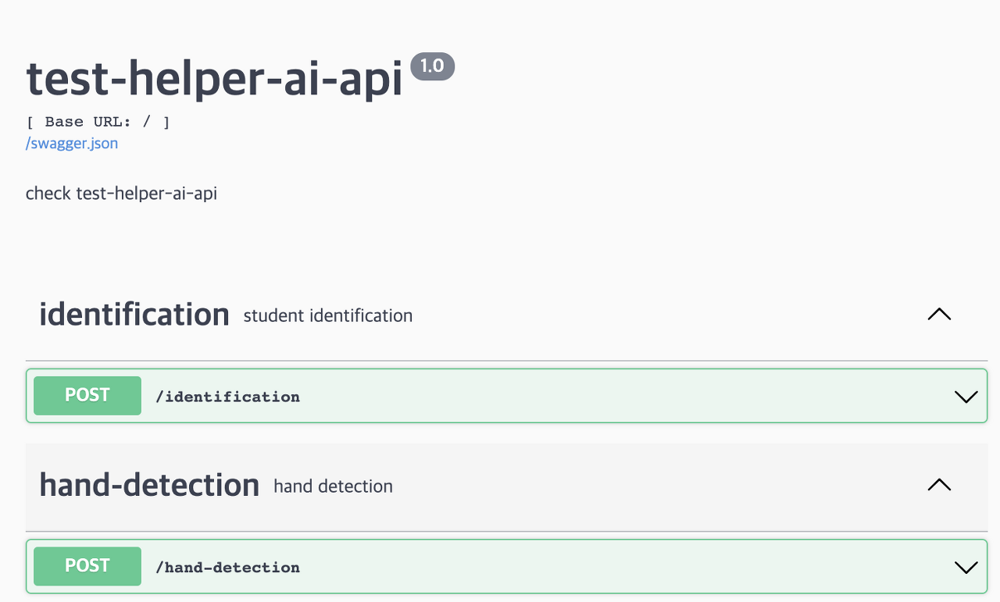
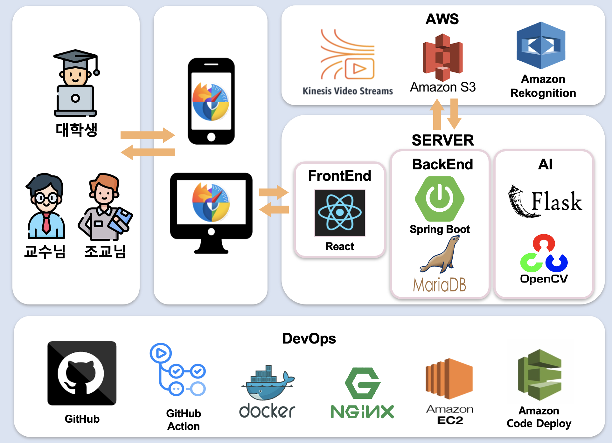

# test-helper-ai
2021-2 SW Capstone Design Project

## 1. Test-Helper 개요
### 개발 동기 및 목적
코로나19로 인해 대학교 시험이 비대면으로 진행되고 있지만, 갑작스러운 환경 전환으로 아직 비대면 시험 환경이 미비합니다. 본 서비스는 AI 기술을 활용하여 비대면 시험에서 발생하는 본인인증 소요 시간 증가, 부정행위 감독의 어려움, 그리고 답안지 제출 및 관리의 복잡함 문제를 해결하고자 합니다.

### 문제점 및 해결 방안
1. 시험 전, 본인 확인 소요 시간 증가 
기존 비대면 시험은 교수/조교가 대학생을 일일이 호명하며 본인인증을 진행하기 때문에 많은 시간이 소요됩니다. AI를 통해 학생증에 있는 학생 번호와 실제 학생 번호의 일치여부 및 학생증 얼굴과 실제 얼굴의 일치 여부를 판단하여 본인인증 절차를 자동화하고자 합니다.

2. 시험 중, 부정행위 감독의 어려움
기존 비대면 시험 방식은 시험 감독관이 다수의 시험 응시자를 감독하다 보니 한계가 존재하였고, 이로 인해 부정행위 사례가 증가하였습니다. 대학생의 두 손을 상시 모니터링하며 화면에서 벗어난 순간, 교수/조교에게 알림을 전송하여 부정행위를 쉽게 확인할 수 있도록 합니다. 또한 시험 응시 과정을 녹화하여 대학생의 부정행위 여부를 시험이 끝나고 나서도 판단할 수 있도록 합니다.

3. 시험 후, 답안지 제출 및 확인 과정의 복잡함
비대면 시험 종료 후, 대학생은 답안지를 촬영하여 이메일로 교수/조교에게 제출하고 교수/조교는 수신된 답안지를 저장하여 관리하는 것이 복잡합니다. 대학생에게 시험 후 답안지 제출 환경을 제공하고, 교수/조교에게 답안지 관리 기능을 제공하여 답안지 제출 및 확인 과정을 단순화하고자 합니다. 


### 기대 효과
SaaS (Software as a Service) 형태로 제공되어 대학교 비대면 시험뿐만 아니라 외부 비대면 시험으로도 확장되어 활용될 수 있을 것으로 기대합니다.


## 2. Build
0. git clone
```bash
$ git clone https://github.com/DA-sc21/test-helper-ai.git
$ cd test-helper-ai/
```

1. local
[http://localhost:5000](http://localhost:5000)
  a. virtual env 사용하는 방법
  ```bash
  $ virtualenv --python=3.7 venv
  $ source venv/bin/activate
  $ pip install -r requirements.txt
  ```

  b. docker 활용하는 방법 (recommend!!!)
  ```bash
  $ docker-compose up --build
  ```

<br />
2. Amazon EC2로 server를 띄운 경우, 
다음 사이트에서 swagger를 통해 API를 확인할 수 있습니다. 

[https://ai.test-helper.com](https://ai.test-helper.com)




## 3. System architecture overview
- 핵심 기술 
  - (test-helper-ai) 본인 인증
    - Amazon Rekognition sdk

  - (test-helper-ai) 두 손 인식
    - [hand-detection](https://github.com/DA-sc21/hand_detection) 연구 결과 활용

  - (test-helper) 시험 감독 비디오 스트리밍
    - AWS Kinesis Video Streams

<br />

- system 구조 


(test-helper-ai)
- flask
  - AI server 구축 

- opencv
  - 두 손 인식 환경 구축 

- Amazon Rekognition
  - 본인인증 자동화 환경 구축

- Amazon S3
  - 본인인증을 위한 학생증, 얼굴 사진 불러옴

<br />

(test-helper)
- react
  - frontend client 구축

- spring boot
  - backend server 구축 

- MariaDB
  - database 구축

- AWS Kinesis Video Streams
  - 시험 감독을 위한 실시간 비디오 스트리밍 환경 구축

- Amazon S3
  - Test-Helper에 필요한 Data Storage 환경 구축

<br />

(DevOps)
- github action
  - 특정 branch에 event 발생 시 CI/CD workflow 자동화

- docker
  - 배포에 용이하도록 container 환경 구축
  
- nginx
  - client과 server 간의 통신을 위한 환경 구축 

- Amazon Code Deploy
  - github action과의 결합으로 Amazon EC2 배포 프로세스 구축

- Amazon EC2 
  - cloud 컴퓨팅 서비스인 Amazon EC2 인스턴스에 Test-Helper 배포


### Team Members

| name |  github | Role |
| ---- | ---- | --- |
| 고예준 | [@KoYeJoon](https://github.com/KoYeJoon) | AI |
| 송지연 | [@SongZzi](https://github.com/SongZzi) | Frontend |
| 우나영 | [@WooNaYoung22](https://github.com/WooNaYoung22) | Backend |
| 이승현 | [@leeshyeon](https://github.com/leeshyeon) | Frontend |
| 최정민 | [@jmchoi1225](https://github.com/jmchoi1225) | Backend |
